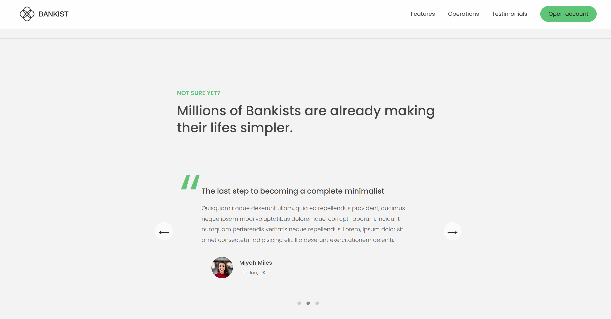
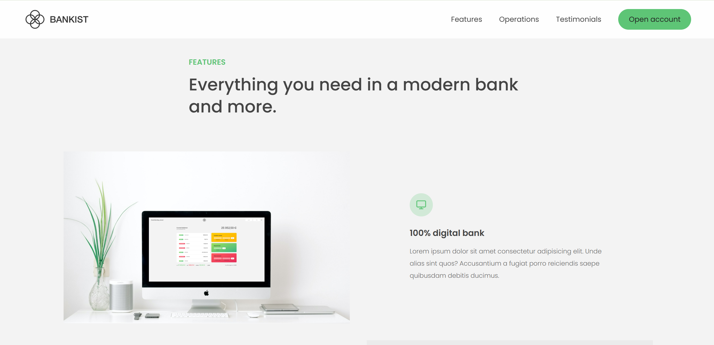
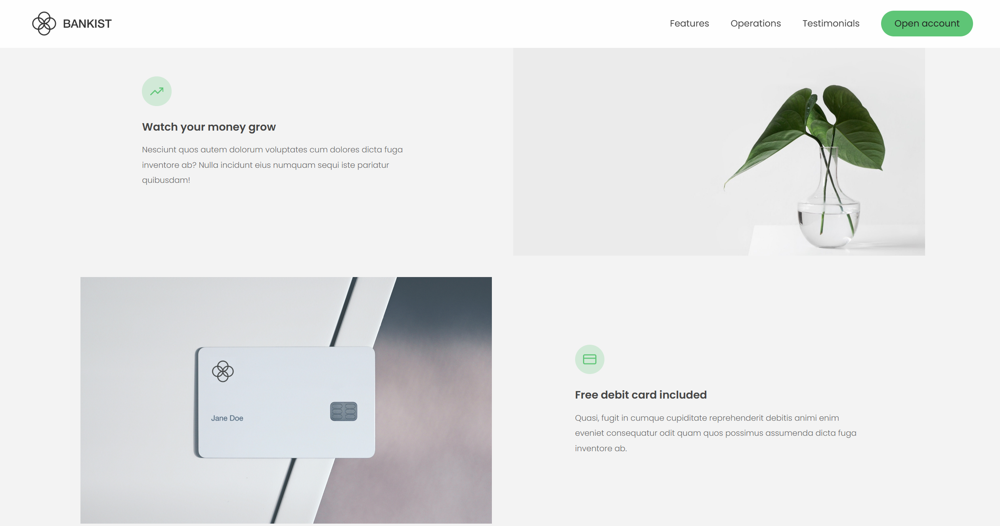

# Bankist - Modern Banking Website

## Overview
Bankist is a minimalist banking website template that combines sleek design with interactive functionality. It showcases a modern user interface for a fictional digital bank, featuring smooth animations, responsive components, and interactive elements.

## Image Previews

### Home Page


### Operations Section


### Testimonials Section


### Modal Window


### Features View




## Features

- **Responsive Navigation**: Clean, accessible navigation with smooth scrolling to sections
- **Modal Windows**: Interactive account opening form
- **Tabbed Component**: Display different operations content with tab switching
- **Slider Component**: Testimonial carousel with dots pagination
- **Lazy Loading Images**: Performance optimization for image loading
- **Sticky Navigation**: Navigation bar that becomes fixed when scrolling
- **Reveal Animation**: Sections animate in as they enter the viewport
- **DOM Manipulation**: Extensive use of modern JavaScript techniques

## Technology Stack

- HTML5
- CSS3
- Modern JavaScript (ES6+)
- Intersection Observer API
- Event Delegation

## Getting Started

### Prerequisites
- A modern web browser (Chrome, Firefox, Safari, Edge)
- Basic understanding of HTML, CSS, and JavaScript

### Installation

1. Clone the repository:
   ```
   git clone https://github.com/yourusername/bankist-website.git
   ```

2. Navigate to the project directory:
   ```
   cd bankist-website
   ```

3. Open the website:
   - Double-click on `index.html` file, or
   - Use a local development server (recommended for proper functionality)

### Setting up a local server

For the best experience, I recommend using a simple HTTP server. You can set one up in several ways:

**Using Visual Studio Code:**
1. Install the "Live Server" extension
2. Right-click on `index.html`
3. Select "Open with Live Server"

**Using Node.js:**
1. Install Node.js from https://nodejs.org/
2. Open a terminal in the project folder
3. Run `npx serve`
4. Open your browser and go to `http://localhost:5000`

**Using Python:**
1. Open a terminal in the project folder
2. Run `python -m http.server` (for Python 3) or `python -m SimpleHTTPServer` (for Python 2)
3. Open your browser and go to `http://localhost:8000`

## Project Structure

```
bankist-website/
├── img/                  # Images and icons
├── index.html            # Main HTML file
├── script.js             # JavaScript with all functionality
├── style.css             # CSS styling (not included in provided files)
└── README.md             # Project documentation
```

## Usage

The website demonstrates various features of a modern banking application:

1. **Navigation**: Click on nav links to smoothly scroll to different sections
2. **Open Account**: Click the "Open account" button to see the modal form
3. **Operations**: Click on the tabbed interface to switch between different banking services
4. **Testimonials**: Use arrow buttons or dots to navigate through customer testimonials
5. **Responsive Design**: View on different devices to see responsive behavior

## Features Explained

### Modal Window
The website features a modal window for account opening that can be triggered from multiple points on the page.

### Smooth Scrolling
Implementation of smooth scrolling to sections when clicking on navigation links, using modern JavaScript.

### Tabbed Component
The Operations section uses a tabbed interface to display different content without reloading the page.

### Slider Component
The testimonial section includes a fully functional slider with navigation controls and pagination dots.

### Lazy Loading
Images are loaded only when they come into the viewport, improving initial page load performance.

### Intersection Observer
Modern API usage for implementing scroll-based animations and lazy loading.

## Credits

This project was created as part of a JavaScript course by Jonas Schmedtmann. The design and concept belong to him. This code is for learning purposes only and should not be used for commercial applications.

## License

This project is intended for educational purposes only. All design and concept rights belong to the original creator. Please do not use for commercial purposes or claim as your own work.

---

Feel free to contribute to this project by creating pull requests or reporting issues!
